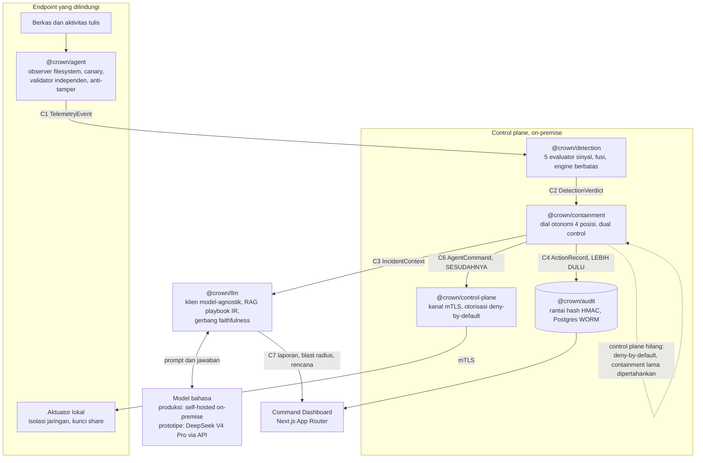
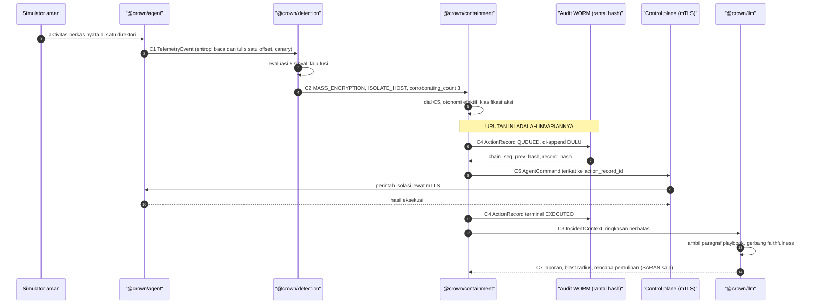
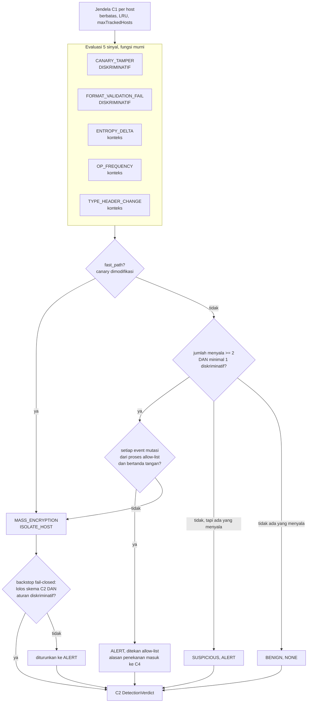

# Crown Defense

[](#lisensi) [](https://crown-defense.vercel.app) [](package.json) [](tsconfig.base.json) [](#status-dan-verifikasi) [](#status-dan-verifikasi)

Ketika ransomware sudah mulai mengenkripsi, pertanyaannya bukan lagi siapa yang menyerang, melainkan berapa detik yang tersisa. Crown Defense adalah sistem pertahanan ransomware otonom kelas perbankan: ia mendeteksi enkripsi massal lewat fusi banyak sinyal, mengisolasi host lewat dial otonomi yang bisa diatur, meminta analisis insiden ke LLM yang di produksi dijalankan sendiri di dalam infrastruktur bank, lalu menuliskan setiap tindakannya ke jejak audit hash-chained yang tidak bisa diubah.

Satu prinsip menaunginya dan tidak pernah dilanggar: **kecepatan deteksi adalah demonya, tetapi tidak-bertindak-keliru, keterbuktian, dan fail-safety adalah produknya.** Alat pertahanan otonom yang salah mengisolasi core banking lebih merusak daripada ransomware yang ia kejar. Karena itu setiap tindakan destruktif melewati dial, terikat catatan audit **sebelum** perintah dikirim, dan bisa dibalik.

> **TL;DR.** Lima evaluator sinyal, dibelah menjadi 2 diskriminatif dan 3 konteks, memutuskan verdict enkripsi massal; sebuah verdict destruktif butuh minimal 2 sinyal menyala **termasuk minimal 1 diskriminatif**, kecuali jebakan canary sudah tersentuh.
> Dial otonomi 4 posisi hidup **di dalam** modul containment, bukan ditempel di atasnya; default-nya MONITOR_ONLY, dan aksi destruktif di posisi HUMAN_GATED wajib approver kedua yang berbeda dari peminta.
> Catatan audit C4 di-append ke rantai hash **sebelum** perintah C6 dikirim ke agen. Urutannya diuji, bukan dijanjikan: `order.slice(0,2) === ['audit','command']`.
> LLM hanya boleh menerbitkan artefak C7 yang bersifat saran. Ia tidak pernah bisa menerbitkan sebuah aksi, dan setiap langkah pemulihan wajib bisa ditelusuri ke satu paragraf playbook yang benar-benar diambil, atau seluruh rencana dialihkan ke manusia.
> Tidak ada satu pun malware asli yang pernah diunduh, dibangun, disimpan, atau dijalankan. Validasi memakai simulator aman yang jinak dan reversibel.

---

## Ringkasan produk

### Masalah yang ditangani

Pada 20 Juni 2024, Brain Cipher, varian yang dibangun di atas builder LockBit 3.0 yang bocor, melumpuhkan Pusat Data Nasional Sementara. **282 layanan** di ratusan instansi pusat dan daerah berhenti. Yang membuatnya menjadi bencana nasional bukan enkripsinya, melainkan yang ditemukan sesudahnya: hanya sekitar **2 persen** data yang punya cadangan. Tebusan **USD 8 juta**, sekitar Rp131 miliar, ditolak, dan itu keputusan yang benar, tetapi penolakan itu tidak mengembalikan data yang tidak pernah dicadangkan.

Posisi Indonesia ikut turun. National Cyber Security Index Indonesia jatuh dari **63,64 pada peringkat 48** tahun 2023 menjadi **47,50 pada peringkat 84 dari 136 negara** tahun 2025.

Sekarang letakkan angka itu berdampingan dengan kecepatan lawan:

| Fakta | Angka | Sumber |
| --- | --- | --- |
| Layanan publik lumpuh pada insiden PDNS | 282 layanan, ratusan instansi | Insiden PDNS, 20 Juni 2024 |
| Data PDNS yang punya cadangan | sekitar 2 persen | Insiden PDNS, 20 Juni 2024 |
| Tebusan yang diminta dan ditolak | USD 8 juta, sekitar Rp131 miliar | Insiden PDNS, 20 Juni 2024 |
| Indeks keamanan siber Indonesia | 63,64 (peringkat 48, 2023) turun ke 47,50 (peringkat 84 dari 136, 2025) | National Cyber Security Index |
| Waktu LockBit mengenkripsi 100.000 berkas | median sekitar 5 menit 50 detik | Splunk SURGe, 2022 |
| Median dwell time ransomware | sekitar 5 hari | Mandiant M-Trends, 2024 |

Dua baris terakhir adalah inti masalahnya. Penyerang berada di dalam jaringan sekitar lima hari tanpa terlihat, lalu menyelesaikan penghancuran dalam waktu di bawah enam menit. Model pertahanan yang menunggu analis manusia membaca tiket kalah secara aritmetika, bukan karena analisnya kurang baik. Satu-satunya jendela yang tersisa berada di antara berkas pertama yang dienkripsi dan berkas ke-sepuluh, dan jendela itu diukur dalam detik.

Teknik yang dipakai keluarga ransomware modern dipetakan ke MITRE ATT&CK sebagai **T1562 Impair Defenses**, **T1490 Inhibit System Recovery**, dan **T1486 Data Encrypted for Impact**. Urutannya jahat secara sengaja: matikan pertahanan, hancurkan jalur pemulihan, baru enkripsi. Saat sebuah bank menyadari T1486 sedang berjalan, T1490 sudah lebih dulu menghapus shadow copy.

### Tesis

Otonomi adalah satu-satunya jawaban yang muat di dalam jendela beberapa detik itu. Tetapi otonomi tanpa rem adalah risiko baru, dan pada infrastruktur perbankan risiko itu bisa lebih besar daripada serangannya. Karena itu Crown Defense tidak dibangun sebagai detektor yang cepat lalu diberi pengaman belakangan. Ia dibangun terbalik: **dial, audit, dan fail-safe hadir sejak baris pertama, dan deteksi dipasang di dalamnya.**

Konsekuensinya konkret dan bisa diperiksa di kode. Modul containment tidak punya jalur untuk bertindak tanpa melewati dial. Modul audit ada sebelum aksi pertama mungkin terjadi. Lapisan LLM secara tipe tidak bisa menerbitkan sebuah aksi. Ketiganya bukan kebijakan tertulis, melainkan bentuk dari kodenya.

### Target yang dijanjikan proposal

Proposal Tim Cyber Crown (Tabel 1.1) mengunci target berikut. Bagian [Status dan verifikasi](#status-dan-verifikasi) menyandingkan setiap target dengan bukti yang benar-benar terukur pada battery simulator aman, dan menyatakan dengan jelas mana yang belum diukur di lapangan.

| Target proposal | Nilai |
| --- | --- |
| Waktu deteksi | dalam hitungan detik |
| False positive pada beban kerja sah | maksimum 0,5 persen |
| Waktu containment | p95 di bawah 10 detik sejak deteksi |
| Berkas terenkripsi sebelum containment | maksimum 10 berkas |
| Cakupan uji | minimal 20 keluarga dan minimal 4 mode evasi |
| Skala armada yang dirancang | 1.000 endpoint |

---

## Demo dan sumber

| | |
| --- | --- |
| Landing page | **https://crown-defense.vercel.app** |
| Command Dashboard | **https://crown-defense.vercel.app/dashboard** |
| Konsol simulasi (berpagar kredensial) | **https://crown-defense.vercel.app/konsol** |
| Repositori | **https://github.com/Finerium/crown-defense** (publik, Apache-2.0) |

Dasbor berjalan dalam **DEMO MODE**: frontend statis ditambah fungsi serverless saja. Datanya sintetis dan berasal dari fixture simulator aman, **tidak pernah dari malware asli**, dan diberi label simulasi di dalam produk. Mesin deteksi, agen containment, control plane, dan dua basis data Postgres berjalan di sebuah host, **bukan** di Vercel. Yang ter-deploy hanya antarmuka dasbor dan satu route serverless untuk LLM.

> **Tentang konsol yang berpagar kredensial.** Setiap kali konsol dijalankan, ia melakukan panggilan sungguhan ke model dan menghabiskan kredit model yang berbayar. Karena itu `/konsol` dipagari login supaya tidak dijalankan oleh lalu lintas anonim. **Kredensialnya dibagikan secara privat kepada dewan juri dan tidak pernah dituliskan di repositori ini.** Tidak ada kredensial di README ini, di kode, di riwayat git, maupun di berkas mana pun yang ter-commit.

### Alur juri yang disarankan

1. Buka **landing page**. Baca posisi produk dan angka nasionalnya, lalu masuk ke dasbor.
2. Di **Command Dashboard**, mulailah dari layar **Overview**: KPI armada, grafik aktivitas ancaman, dan feed aksi otonom. Perhatikan bahwa setiap baris feed menyebut aksi apa yang diambil dan atas dasar apa.
3. Pindah ke layar **Incident**. Di sini ada tiga hal yang layak diperiksa berdampingan: peta blast radius dengan status per host, sinyal deteksi yang menyala beserta yang tidak, dan lini masa insiden. Cari baris yang menyatakan catatan audit terikat **sebelum** perintah. Itu bukan hiasan naratif, itu urutan yang diuji di `packages/test-infra/src/closed-loop.test.ts`.
4. Masih di layar Incident, tekan **Generate incident report**. Sebuah fungsi serverless memanggil DeepSeek secara langsung, hasilnya dilewatkan **gerbang faithfulness**, dan yang dirender adalah rencana pemulihan dengan sitasi playbook plus skor faithfulness. Keluaran yang tidak bisa ditelusuri tidak ditampilkan sebagai otoritatif, melainkan dialihkan ke manusia.
5. Buka layar **Fleet** untuk melihat daftar host yang berpaginasi dan berbatas, lalu layar **System** untuk melihat panel Autonomy Policy: dial 4 posisi, otonomi efektif, dan status fail-safe. Geser dial dan perhatikan klasifikasi aksi ikut berubah.
6. Ganti bahasa **EN / ID** di kanan atas. Seluruh antarmuka termasuk label aksesibilitas ikut berganti, bukan hanya teks isi.
7. Terakhir, buka **konsol simulasi** dengan kredensial yang dibagikan privat, dan jalankan satu skenario dari awal sampai akhir.

---

## Arsitektur

Crown Defense adalah monorepo pnpm TypeScript-strict di atas Node ESM. Sembilan paket dengan batas yang tegas, disambungkan oleh satu himpunan kontrak Zod beku (`@crown/contracts`) yang menjadi tulang punggung anti-divergensi: setiap komponen dibangun terhadap bentuk field yang sama persis, sehingga dua modul tidak bisa diam-diam berbeda tafsir.



### Tata letak paket

```
packages/
  contracts/      skema Zod C1 sampai C10 plus invarian yang dieksekusi
  audit/          inti rantai hash HMAC plus store Postgres WORM
  simulator/      simulator aman parametrik, oracle deteksi
  test-infra/     suite beban kerja jinak, harness penilaian, uji closed loop
  agent/          observer filesystem userspace, canary, aktuator, anti-tamper
  detection/      5 evaluator sinyal, fusi, engine berjendela terbatas
  containment/    penegakan dial, dual control, audit mendahului aksi
  control-plane/  kanal mTLS, otorisasi, distribusi perintah
  llm/            klien model-agnostik, RAG, gerbang faithfulness
apps/
  dashboard/      Next.js App Router di atas token desain
```

Dial otonomi **tidak** punya paketnya sendiri, dan itu disengaja. Ia hidup di dalam `packages/containment/src/policy.ts`, tepat di jalur yang harus dilewati setiap keputusan containment, sehingga tidak ada jalan pintas yang melewatinya. Adapter integrasi SIEM, AD, dan EDR (C8) sengaja belum dibangun, lihat bagian [Status dan verifikasi](#status-dan-verifikasi).

### Aliran data closed loop

Ikuti satu serangan dari byte pertama sampai laporan, dengan nama kontrak bekunya.

**C1 TelemetryEvent.** Agen mengamati aktivitas berkas dan menerbitkan telemetri. Dua invarian melekat di kontraknya: entropi baca dan entropi tulis diambil pada **offset yang sama** supaya deltanya bermakna (ADR-011, metode Redemption), dan event `CANARY_TOUCHED` tidak pernah boleh dibuang. Agen memakai validator formatnya sendiri, terpisah dari milik simulator, supaya deteksi tidak sedang menilai pekerjaannya sendiri.

**C2 DetectionVerdict.** Mesin deteksi memutuskan **hanya dari C1**. Ia tidak pernah melihat label kebenaran, tidak pernah mengimpor oracle. Invarian yang dikunci di skema: sebuah rekomendasi `ISOLATE_HOST` mensyaratkan `corroborating_count >= 2` **atau** `fast_path === true`, dan `corroborating_count` diikat ke jumlah sinyal yang benar-benar menyala sehingga produsen tidak bisa melaporkan angka yang digelembungkan untuk menyelundupkan isolasi.

**C4 ActionRecord.** Sebelum perintah apa pun dikirim, containment meng-append catatan aksi ke rantai audit. Untuk aksi destruktif di posisi HUMAN_GATED, skema menolak catatan yang approver-nya sama dengan aktornya.

**C6 AgentCommand.** Barulah perintah dikirim lewat kanal mTLS. Perintah destruktif membawa `action_record_id`, dan agen menolak perintah destruktif yang catatan auditnya tidak bisa ia resolusikan. Otorisasinya fail-closed lewat allow-list, bukan sekadar pemeriksaan keberadaan field.

**C7 IncidentReport, BlastRadiusMap, RecoveryPlan.** Terakhir, dan hanya sesudah containment, lapisan LLM menerbitkan artefak yang bersifat **saran**. Tipe keluarannya secara harfiah tidak memuat `ActionRecord` maupun `AgentCommand`, jadi model tidak punya cara mengetik untuk memerintahkan sesuatu.



Pada jalur gagal, urutan yang sama berhenti lebih awal dan berhenti dengan aman. Saat control plane tidak terjangkau, `decideContainment` mengembalikan `DENY_FAILSAFE`: tidak ada perintah yang dikirim sama sekali, `issuer.issue` tidak pernah dipanggil, dan containment yang sudah berjalan dipertahankan oleh agen secara lokal. Ini diuji, bukan diasumsikan.

---

## Cara kerja deteksi

### Kejujuran soal jumlah sinyal

Proposal menyebut **empat** sinyal utama: canary, entropi, frekuensi operasi, dan validasi format. Kode yang benar-benar berjalan mengimplementasikan **lima** evaluator: keempat itu ditambah `TYPE_HEADER_CHANGE`, sinyal konteks tambahan yang lahir saat pembangunan ketika review adversarial menunjukkan perlunya pembeda antara perubahan tipe berkas dan hilangnya validitas struktur. Jadi lima adalah superset dari empat, bukan angka yang berbeda.

Enum kontrak C2 juga mencadangkan satu nilai bernama `ML_CLASSIFIER`. **Nilai itu tidak diimplementasikan.** Tidak ada model machine learning di jalur deteksi, dan repositori ini tidak menggambarkannya sebagai sesuatu yang sudah dibangun. Ia dicadangkan supaya penambahan di masa depan tidak menjadi perubahan kontrak yang memecah.

### Lima evaluator, dibelah 2 dan 3

Pembelahan inilah temuan korektif terpenting dalam pembangunan ini, dan ia datang dari sebuah kegagalan review, bukan dari desain awal.

| Evaluator | Kelas | Menyala ketika | Implementasi |
| --- | --- | --- | --- |
| `CANARY_TAMPER` | **Diskriminatif** | Berkas jebakan di-WRITE, RENAME, atau DELETE. Tidak pernah menyala pada READ | `evalCanary` |
| `FORMAT_VALIDATION_FAIL` | **Diskriminatif** | Beberapa berkas kehilangan validitas struktur, minimal `formatFailMinCount` berkas | `evalFormatValidation` |
| `ENTROPY_DELTA` | Konteks | Entropi naik dari basis rendah ke tinggi pada beberapa berkas, diukur pada offset yang sama | `evalEntropyDelta` |
| `OP_FREQUENCY` | Konteks | Laju tulis atau rename sesaat melewati ambang, **atau** aktivitas kumulatif dalam jendela melewati ambang (penangkap low-and-slow) | `evalOpFrequency` |
| `TYPE_HEADER_CHANGE` | Konteks | Header atau tipe berkas berubah pada beberapa berkas | `evalTypeHeader` |

Alasan pembelahannya bisa dinyatakan dalam satu kalimat: **kompresi dan enkripsi sama-sama menaikkan entropi dan frekuensi operasi, dan konversi format yang sah sama-sama mengubah tipe dan header.** Hanya hilangnya validitas struktur, atau modifikasi berkas jebakan, yang benar-benar membedakan enkripsi. Sinyal konteks boleh menguatkan, tetapi tidak pernah boleh mengisolasi sebuah host sendirian.

### Aturan fusi yang tepat

```
destructive = fast_path
              OR ( corroborating_count >= cfg.minCorroboration
                   AND minimal satu sinyal DISKRIMINATIF menyala )
```

Empat properti membuat aturan ini bukan sekadar ambang:

- `corroborating_count` adalah jumlah sinyal yang **benar-benar menyala**, dihitung ulang di jalur data. Ia tidak pernah dilaporkan sendiri oleh pemanggil.
- `cfg.minCorroboration` dapat dikonfigurasi lewat environment, tetapi **dijepit ke minimal 2** di `loadConfig`. Konfigurasi bisa memperketat, tidak pernah bisa memperlonggar.
- Fusi bersifat **fail-closed**. Setelah verdict dirakit, ia divalidasi ulang terhadap skema C2 beku **dan** diperiksa ulang secara independen terhadap aturan diskriminatif. Jika salah satu gagal, aksi diturunkan menjadi `ALERT`, bukan diteruskan.
- Ada **penekanan berbasis allow-list yang bisa diaudit**, dan pagarnya ketat: penekanan hanya berlaku bila **setiap** event mutasi pembawa sinyal berasal dari proses yang ada di allow-list dan bertanda tangan, dan **tidak pernah** berlaku menimpa fast-path canary. Alasannya jelas: full-disk encryption yang sah memang terlihat seperti serangan, sedangkan ransomware yang sah tidak pernah menyentuh berkas jebakan.



### Mengapa entropi saja gagal, dan bagaimana validasi format menutupnya

Entropi adalah sinyal yang paling sering dikutip dan paling mudah dihindari. Tiga alasan, semuanya teramati di battery ini:

**Pertama, berkas yang sudah bernilai entropi tinggi tidak punya delta.** Mengenkripsi mp4, jpg, atau zip yang sudah termampatkan menghasilkan kenaikan entropi mendekati nol. Detektor berbasis entropi diam saja sementara berkas hancur.

**Kedua, kompresi yang sah terlihat identik.** Kompaksi log, konversi gambar, dan arsip zstd atau lz4 menaikkan entropi ke pita yang sama dengan ciphertext. Membuat ambang entropi cukup sensitif untuk menangkap enkripsi berarti membuatnya cukup sensitif untuk mengisolasi host yang sedang memampatkan log. Review adversarial membuktikan ini bukan teori: pada iterasi pertama, konversi png ke webp dan kompaksi log di tempat **benar-benar mencapai ISOLATE_HOST** melalui engine sungguhan.

**Ketiga, dan paling penting, enkripsi intermiten membuat entropi rata.** Keluarga modern hanya mengenkripsi sebagian berkas, misalnya setiap N byte atau hanya 4 KB pertama. Berkasnya rusak total dan tidak bisa dipakai, tetapi rata-rata entropinya hampir tidak bergerak.

Validasi format menyerang persoalan dari sudut yang berbeda: bukan seberapa acak byte-nya, melainkan **apakah berkas ini masih berkas yang sah**. Sebuah png dengan chunk CRC yang tidak cocok sudah rusak, tidak peduli berapa entropinya. Sebuah zip yang direktori pusatnya tidak bisa di-parse sudah rusak. Kerusakan struktural inilah tanda enkripsi yang sesungguhnya, dan enkripsi intermiten tidak bisa menghindarinya karena merusak struktur justru bagian dari cara kerjanya.

Klaim ini diuji secara falsifiable lewat **ablasi**, bukan lewat argumen. Skenario intermiten dijalankan **di tempat**, tanpa rename, sehingga entropi rata, magic byte utuh, dan tidak ada perubahan tipe. Lalu sinyal `format_valid` dicabut dan battery dijalankan ulang. Hasilnya tercatat di `reports/detection/intermittent.json` per keluarga sebagai `detected_with_format: true` dan `detected_without_format: false`. Ketika sinyalnya dicabut, deteksinya hilang. Itulah arti "load-bearing".

### Batas yang jujur pada deteksi

Ada satu kelas berkas yang tidak tertangkap andal di level berkas tunggal: **enkripsi intermiten pada format yang dikenali agen tetapi tidak divalidasi secara mendalam**, misalnya jpg, gif, bmp, dan mp4, yang validasinya berhenti pada marker atau magic byte. Formatnya tetap dinilai "valid", jadi tidak ada sinyal diskriminatif dari berkas itu. Pertahanannya berada di level host: kampanye nyata juga menyentuh tipe yang divalidasi dalam (png, zip, dokumen office) yang **memang** memicu kegagalan format, dan frekuensi operasi ikut menguatkan. Memperluas pustaka validator mendalam adalah pekerjaan produksi, bukan klaim hari ini.

---

## Anti-halusinasi pada lapisan LLM

Sebuah LLM yang mengarang langkah pemulihan di tengah insiden ransomware bukan gangguan kecil. Ia bisa menyuruh analis menghapus bukti, memulihkan dari cadangan yang justru sudah terkontaminasi, atau membayar tebusan. Karena itu lapisan LLM Crown Defense dibangun dengan asumsi bahwa modelnya bisa salah.

Empat pagar bekerja berurutan:

**Pagar 1, batas tipe.** Orkestrator LLM secara harfiah hanya bisa menerbitkan artefak C7: `IncidentReport`, `BlastRadiusMap`, `RecoveryPlan`. Tidak ada jalur tipe menuju `ActionRecord` maupun `AgentCommand`. Sebuah model yang berhalusinasi paling jauh hanya bisa menghasilkan saran yang buruk, tidak pernah aksi.

**Pagar 2, blast radius diturunkan, bukan dikarang.** Peta blast radius dihitung dari `IncidentContext` secara deterministik. Model tidak pernah diminta menebak host mana yang terdampak.

**Pagar 3, RAG di atas playbook IR.** Retriever TF-IDF tanpa dependensi mengambil paragraf paling relevan dari `IR_PLAYBOOK` di `packages/llm/src/playbook.ts`, sebuah korpus yang disusun dari kerangka publik NIST SP 800-61 dan pemetaan MITRE ATT&CK. Di deployment nyata, bank memasukkan playbook-nya sendiri.

**Pagar 4, gerbang faithfulness.** Setiap langkah rencana dan setiap sitasi laporan harus lulus dua ujian sekaligus: id playbook yang dikutip harus **benar-benar ada di antara paragraf yang diambil**, dan isi klaimnya harus **didukung**, yaitu berbagi minimal `minSupportTerms` istilah bermakna dengan paragraf itu. Skor lulus jika mencapai ambang **dan** tidak ada satu pun sitasi yang dikarang. Satu id palsu mendiskualifikasi seluruh rencana.

### Contoh konkret: satu langkah lolos, satu ditolak

<details>
<summary>Lihat keluaran model dan keputusan gerbangnya</summary>

Model mengembalikan dua langkah pemulihan. Yang pertama mengutip `PB-CONTAIN-ISOLATE`, paragraf yang benar-benar ada di playbook dan benar-benar diambil oleh retriever untuk insiden ini. Yang kedua mengutip `PB-PAY-RANSOM`, sebuah id yang tidak ada di playbook mana pun.

```json
{
  "steps": [
    {
      "order": 1,
      "action": "Isolate host BJB-WS-0412 from the network",
      "rationale": "Halt the spread of encryption while preserving the host for forensic imaging.",
      "playbook_ref": "PB-CONTAIN-ISOLATE"
    },
    {
      "order": 2,
      "action": "Pay the ransom via a negotiation broker to obtain the decryption key",
      "rationale": "Fastest path back to operations.",
      "playbook_ref": "PB-PAY-RANSOM"
    }
  ]
}
```

**Langkah 1 LOLOS.** `PB-CONTAIN-ISOLATE` ada di antara paragraf yang diambil, jadi `ref_exists = true`. Isi paragraf itu berbunyi: "isolate the affected host from the network immediately to halt the spread of encryption while preserving the host for forensic imaging". Klaim dan paragraf berbagi jauh lebih dari dua istilah bermakna (`isolate`, `host`, `network`, `halt`, `spread`, `encryption`, `forensic`, `imaging`), jadi `supported = true`. Hasilnya `faithful = true`.

**Langkah 2 DITOLAK.** `PB-PAY-RANSOM` tidak ada di korpus, jadi `ref_exists = false` dan `faithful = false`. Karena gerbangnya mensyaratkan **tidak ada sitasi yang dikarang**, satu id palsu ini membuat `passed = false` untuk seluruh rencana, bukan hanya untuk langkah itu. Statusnya menjadi `BLOCKED_LOW_FAITHFULNESS` dan hasilnya `routed_to_human`. Yang dilihat analis adalah pengalihan ke manusia, bukan rencana yang fasih tetapi tanpa dasar.

Playbook justru memuat kebalikannya. Paragraf `PB-NO-RANSOM` menyatakan, mengikuti panduan penegak hukum, bahwa tebusan tidak dibayar karena pembayaran tidak menjamin pemulihan dan mendanai kejahatan berikutnya. Sebuah model yang menganjurkan pembayaran sedang bertentangan dengan korpusnya sendiri, dan gerbang inilah yang menangkapnya.

Perilaku ini punya bukti tersendiri di `reports/llm/negative.json`, yang mencatat status `BLOCKED_LOW_FAITHFULNESS`, `routed_to_human: true`, dan klaim tak berdukung yang ditolak.

</details>

Sisi positifnya juga terekam. `reports/llm/faithfulness.json` mencatat sebuah analisis yang lulus dengan skor `1`, nol klaim tak berdukung, dan langkah-langkah yang terlacak ke `PB-CONTAIN-ISOLATE`, `PB-CONTAIN-LATERAL`, serta `PB-RECOVER-BACKUP`. Pada demo langsung saat Gate 6, `reports/dashboard/deploy.json` mencatat panggilan DeepSeek sungguhan dengan faithfulness `1` dan 16 klaim bersitasi.

Jalur itu sempat mati, dan riwayatnya layak ditulis. Pada 2 Agustus 2026 kunci API DeepSeek yang dipakai purwarupa kedaluwarsa, penyedia menolaknya dengan HTTP 401, dan `/api/analyze` mengembalikan `LLM_UNAVAILABLE`. Kuncinya sudah diganti pada hari yang sama dan jalurnya **terverifikasi ulang**: HTTP 200 dengan status `OK`, `live: true`, `degraded: false`, model `deepseek-v4-pro`, kesetiaan `1` lulus, 15 klaim bersitasi tanpa satu pun klaim tak berdukung, dan rencana pemulihan 7 langkah. Yang tetap layak dicatat dari pemadaman itu bukan pemadamannya, melainkan apa yang ia buktikan tanpa diminta: lapisan LLM mati tidak menghentikan deteksi maupun containment, dan tidak ada tindakan destruktif baru yang dimulai. Perilaku fail-safe itu diuji, lalu kebetulan diuji sekali lagi oleh kejadian sungguhan.

Ketika model tidak terjangkau, orkestrator mengembalikan status `LLM_UNAVAILABLE` dengan `degraded: true` dan **tetap mengembalikan blast radius**, karena peta itu deterministik. Deteksi dan containment tidak terpengaruh sama sekali: LLM bersifat saran dan berjalan **sesudah** containment, bukan di jalur kritisnya. Itu bukan pembelaan retoris, dan latensinya yang mengukur: satu percobaan orkestrasi memakan 51 sampai 64 detik dan round trip rute langsung penuh sekitar 76 detik. Angka sebesar itu akan fatal di jalur deteksi, dan justru karena itu lapisan LLM tidak pernah diletakkan di sana.

---

## Dial otonomi dan matriks aksi

Dial punya empat posisi, dan default yang dikirim adalah yang paling konservatif.

| Posisi | Arti | Aksi destruktif |
| --- | --- | --- |
| `MONITOR_ONLY` | **Default.** Catat saja | NEVER_AUTO |
| `ALERT_RECOMMEND` | Beri peringatan dan rekomendasi, jangan bertindak | NEVER_AUTO |
| `HUMAN_GATED` | Ajukan untuk persetujuan | ASK_TO_ACT, wajib dual control |
| `FULL_AUTO` | Bertindak sekarang, audit tetap mendahului perintah | AUTO |

Aksi destruktif adalah `ISOLATE_HOST`, `KILL_PROCESS`, dan `LOCK_SHARES`. Aksi pembalik seperti `RELEASE_HOST` dan `UNLOCK_SHARES` diklasifikasikan `ASK_TO_ACT` juga: melepaskan containment adalah keputusan yang tetap layak diaudit.

Yang membedakan dial ini dari sebuah setting adalah **otonomi efektif**. Posisi yang dikonfigurasi bukan posisi yang berlaku. `effectiveAutonomy()` menurunkan otonomi yang berlaku saat control plane tidak terjangkau, sehingga sebuah host yang dikonfigurasi `FULL_AUTO` tetapi kehilangan control plane akan berperilaku `MONITOR_ONLY` dan mengembalikan `DENY_FAILSAFE`. Tidak ada perintah destruktif baru yang dikirim, dan containment yang sudah berjalan tetap dipertahankan agen secara lokal.

### Dual control

Di posisi `HUMAN_GATED`, sebuah aksi destruktif memerlukan **approver kedua yang berbeda dari peminta**. Ini ditegakkan di dua tempat, bukan satu:

- Di hulu, refinement skema C4 menolak sebuah `ActionRecord` destruktif yang approver-nya sama dengan aktornya.
- Di hilir, `AgentCommand` membawa `requestor_id` yang bisa null dan agen menegakkan `approver_id !== requestor_id` lewat allow-list `rejectionReason` yang fail-closed.

Bagian kedua adalah hasil **konflik kontrak yang disurfacekan, bukan diam-diam ditambal**. C6 beku mensyaratkan approver yang berbeda, tetapi tidak menyediakan id peminta untuk dibandingkan, sehingga distingsinya tidak bisa ditegakkan di sisi agen sebagaimana tertulis. Resolusinya adalah refinement aditif yang nullable, dicatat sebagai konflik blueprint di `docs/internal/notes.md` dan di `.crown/progress.json`, mengikuti aturan anti-divergensi.

Buktinya ada di `reports/actuation/authz.json`: `monitor_only_rejected`, `human_gated_no_approver_rejected`, dan `human_gated_distinct_approver_allowed`, ketiganya `true`. Uji negatifnya ditulis, bukan hanya jalur bahagianya.

---

## Audit yang tidak bisa diubah

Substrat audit ada **sebelum** aksi pertama mungkin terjadi. Itu urutan pembangunannya, bukan kebetulan.

**Rantai hash.** Setiap `ActionRecord` di-HMAC-SHA256 atas kontennya yang dikanonikalisasi, termasuk `prev_hash` dan `chain_seq`, mengecualikan `record_hash` itu sendiri. Kanonikalisasinya deterministik dengan kunci terurut sehingga catatan yang sama selalu menghasilkan hash yang sama. Kuncinya HMAC dan bukan hash biasa, dan bedanya penting: rantai hash polos hanya tamper-evident bila penyerang tidak bisa menghitung ulang seluruh rantai. Dengan HMAC, pemalsuan memerlukan `AUDIT_INTEGRITY_KEY`, bukan sekadar akses tulis.

**WORM di lapisan basis data.** Store audit adalah basis data Postgres terpisah dari store operasional (ADR-013), dengan trigger yang menolak UPDATE dan DELETE pada catatan audit. Aplikasi menghitung rantai; basis data menolak mutasi. Dua lapisan, bukan satu.

**Audit mendahului aksi.** Ini invarian yang paling sering diklaim orang dan paling jarang diuji. Di sini urutannya diuji secara langsung. `reports/actuation/audit_order.json` mencatat `order: ["audit","command","audit"]` terhadap **basis data yang hidup**, dengan `chain_valid: true` dan `record_persisted: true`. Polanya dua fase: sebuah catatan niat `QUEUED` mendahului perintah, lalu catatan terminal `EXECUTED`, `FAILED`, atau `BLOCKED` mencatat hasil sebenarnya. Uji closed loop menegaskan hal yang sama dari sisi kode: `order.slice(0,2) === ['audit','command']`.

**Verifikasi tamper.** Verifikasi rantai mengembalikan `brokenAt`, yaitu nomor urut catatan pertama yang rusak, sehingga perusakan tidak hanya terdeteksi tetapi juga terlokalisasi. Perbandingan hash memakai `timingSafeEqual`.

Kejujuran soal batas: trigger WORM masih bisa dilewati oleh pemilik basis data, dan kunci HMAC saat ini berada satu tempat dengan kredensial basis data. Peran penulis audit dengan hak minimal dan kunci di KMS atau HSM tercatat sebagai pekerjaan produksi di `docs/architecture.md` bagian 7, dan tidak diklaim selesai.

---

## Pilihan teknologi

Setiap keputusan diuji terhadap alternatif yang material. ADR-001 sampai ADR-015 terkunci di blueprint dan tidak diperdebatkan ulang; ADR-016 adalah keputusan implementasi yang diambil pembangunan ini di dalam batas tersebut. Ringkasannya ada di [`docs/adr/README.md`](docs/adr/README.md) dan uraian lengkapnya di [`docs/architecture.md`](docs/architecture.md).

| Keputusan | Alasan | Alternatif yang ditolak |
| --- | --- | --- |
| Fusi banyak sinyal dengan fast-path canary, minimal 2 sinyal untuk verdict destruktif (ADR-001) | Sinyal tunggal bisa dihindari dan menghasilkan false positive yang merusak. Validasi format menutup enkripsi intermiten yang membuat entropi rata | Deteksi berbasis entropi saja, terbukti menghasilkan isolasi keliru pada kompresi dan konversi yang sah di review pertama; klasifier ML sebagai penentu utama, tidak bisa diaudit di jalur destruktif |
| LLM open-weight self-hosted on-premise, model-agnostik (ADR-002) | Telemetri keamanan tidak boleh keluar dari kendali bank. Abstraksi membuat penggantian model menjadi perubahan konfigurasi | LLM cloud sebagai jawaban produksi, telemetri keamanan keluar dari perimeter; fine-tuning di pembangunan ini, biaya besar tanpa jaminan faithfulness |
| Otonomi sebagai dial 4 posisi ditambah matriks klasifikasi (ADR-003) | Bank tidak akan menyalakan otonomi penuh pada hari pertama. Dial membuat adopsinya bertahap dan bisa dikembalikan | Sakelar biner otonom atau tidak, tidak bisa diadopsi bertahap; kebijakan hanya di dokumen, tidak ditegakkan kode |
| Subsistem audit hash-chained sebagai komponen kelas satu (ADR-004) | Keterbuktian adalah produknya. Substrat harus ada sebelum aksi pertama mungkin terjadi | Logging biasa ke berkas, bisa diubah dan tidak bisa dibuktikan; audit ditambahkan belakangan, aksi pertama sudah tidak terlindungi |
| Store audit dipisah dari store operasional (ADR-013) | Immutabilitas tidak boleh terjerat dengan tulisan operasional yang bervolume tinggi | Satu basis data untuk keduanya, permukaan WORM ikut menanggung churn operasional |
| mTLS ditambah identitas sertifikat, otorisasi deny-by-default (ADR-007) | Batas aktuasi adalah target bernilai tertinggi. Keanggotaan CA saja bukan otoritas | Otentikasi berbasis token saja; menerima peer mana pun yang berantai ke CA, ditemukan sebagai celah nyata di review Gate 3 |
| RAG di atas playbook IR ditambah gerbang faithfulness (ADR-008) | Penolakan yang aman lebih baik daripada jawaban fasih tanpa dasar | Membiarkan model menjawab bebas; fine-tuning untuk kepatuhan format, tidak menyelesaikan ketertelusuran |
| Monorepo pnpm TypeScript-strict, Node ESM (ADR-016) | Satu bahasa melintasi deteksi, control plane, LLM, dasbor, dan simulator. Kontrak Zod yang sama memberi validasi batas saat runtime secara gratis | Rust atau Go untuk agen dan TypeScript untuk sisanya, dua kontrak yang bisa hanyut dalam waktu hackathon; Python, tidak sejalan dengan dasbor dan kontrak bersama |
| Backend monitoring userspace untuk pembangunan ini (ADR-006) | Kontrak C1 identik di atas backend mana pun. eBPF dan minifilter adalah backend produksi yang terdokumentasi | Menulis driver kernel sekarang, penandatanganan driver Windows adalah proses berpagar manusia dan bukan pemblokir pembangunan |

Keterbatasan yang diterima secara sadar dan dicatat jujur: backend userspace **tidak** punya atribusi proses, sehingga field proses bernilai null. Allow-list dan dual control bergantung pada atribusi itu, jadi penekanan allow-list diuji lewat C1 simulator yang memang membawa konteks proses, bukan lewat observer userspace. Di produksi, eBPF dan minifilter menyediakan pid, path, dan status tanda tangan.

---

## Batas keamanan

Ini bukan kekurangan kemampuan, melainkan penolakan yang disengaja.

**Crown Defense tidak pernah mengunduh, menangani, membangun, menyimpan, atau menjalankan malware asli atau hidup.** Tidak sekali pun, dalam bentuk apa pun, pada tahap mana pun.

Seluruh validasi deteksi memakai **simulator aman** di `packages/simulator/`, yang menurut konstruksinya:

- **Jinak.** Ia melakukan XOR dengan kunci yang diturunkan, bukan enkripsi kriptografis yang menyandera.
- **Reversibel.** Kuncinya disimpan, jadi setiap perubahan bisa dikembalikan.
- **Satu direktori.** Penulisan dikurung secara leksikal di bawah root yang sudah di-`realpath`, dan penyemaian memakai flag `wx` exclusive-create sehingga symlink yang ditanam lebih dulu tidak bisa mengalihkan tulisan ke luar direktori target.
- **Tidak menular.** Ia hanya menyentuh berkas yang ia semai sendiri.
- **Tanpa jaringan dan tanpa proses anak.** Tidak ada soket, tidak ada spawn.

Ia melakukan I/O berkas sungguhan supaya agen mengamati direktori yang sama seperti pada serangan nyata, dan ia menerbitkan telemetri C1 kebenaran-dasar yang dikonsumsi mesin deteksi. Keluarga dan mode evasinya adalah **profil perilaku parametrik**, bukan sampel.

Prosedur detonasi sampel asli ada **hanya sebagai dokumentasi** di [`docs/runbooks/air-gapped-detonation-runbook.md`](docs/runbooks/air-gapped-detonation-runbook.md). Runbook itu **belum pernah dijalankan**. Ia ditulis untuk dieksekusi manusia di laboratorium air-gapped, di luar repositori ini, dan pengujian ransomware asli tercatat sebagai pekerjaan berpagar manusia.

---

## Menjalankan secara lokal

Prasyarat: **Node.js 22 atau lebih baru**, **pnpm**, dan **Docker** untuk kedua basis data Postgres.

```bash
# 1. Salin environment
cp .env.example .env
# isi CONTROL_PLANE_TOKEN_SECRET dan AUDIT_INTEGRITY_KEY, masing-masing dengan:
#   openssl rand -hex 32
# DEEPSEEK_API_KEY hanya diperlukan untuk uji model langsung (dev dan test saja, ADR-002)

# 2. Pasang dependency
pnpm install

# 3. Nyalakan basis data (satu instance Postgres, dua basis data terpisah per ADR-013)
pnpm db:up

# 4. Jalankan migrasi (store operasional dan store audit)
pnpm db:migrate

# 5. Uji dan typecheck
pnpm test
pnpm typecheck

# 6. Jalankan dasbor
pnpm --filter @crown/dashboard dev     # http://localhost:3100
```

Tanpa langkah 3 dan 4, empat uji yang bergantung basis data langsung akan gagal; 170 uji sisanya tetap lulus, dengan catatan `DEEPSEEK_API_KEY` terisi. Tanpa kunci itu, uji integrasi model langsung ikut gagal sehingga yang gagal menjadi lima. Rinciannya ada di [Status dan verifikasi](#status-dan-verifikasi).

## Perintah

Hanya perintah yang benar-benar ada di `package.json`.

| Perintah | Fungsi |
| --- | --- |
| `pnpm test` | Menjalankan seluruh suite Vitest sekali jalan |
| `pnpm test:watch` | Vitest dalam mode watch |
| `pnpm typecheck` | `tsc -b`, typecheck strict seluruh monorepo |
| `pnpm lint` | `biome lint .` |
| `pnpm check` | `biome check .`, lint ditambah format |
| `pnpm format` | `biome format --write .` |
| `pnpm db:up` | Menyalakan container Postgres lalu menunggu sampai sehat |
| `pnpm db:down` | Mematikan container basis data |
| `pnpm db:migrate` | Menjalankan migrasi store operasional dan store audit |
| `pnpm gate1:evidence` | Membangkitkan artefak bukti Gate 1 ke `reports/` |
| `pnpm gate2:evidence` | Membangkitkan artefak bukti Gate 2 ke `reports/` |
| `pnpm gate3:evidence` | Membangkitkan artefak bukti Gate 3 ke `reports/` |
| `pnpm gate4:evidence` | Membangkitkan artefak bukti Gate 4 ke `reports/` |
| `pnpm --filter @crown/dashboard dev` | Menjalankan Command Dashboard di port 3100 |
| `pnpm --filter @crown/dashboard build` | Build produksi dasbor |

Gate 5 dan Gate 6 tidak punya skrip bukti tersendiri. Buktinya adalah manifest yang ditulis tangan ditambah verifikasi browser, tercatat di `reports/manifests/gate-5.manifest.json` dan `gate-6.manifest.json`.

---

## Status dan verifikasi

Setiap klaim di bawah ini menyebut perintah atau berkas bukti yang membuktikannya. Tidak ada centang hijau yang tidak diperoleh.

### Gate

| Gate | Lingkup | Status | Bukti |
| --- | --- | --- | --- |
| 0 | Fondasi: kontrak, substrat audit WORM hash-chained, harness, arsitektur | lulus | `packages/contracts`, `packages/audit`, `docs/architecture.md` |
| 1 | Infrastruktur uji aman dan oracle deteksi | lulus | `reports/manifests/gate-1.manifest.json` |
| 2 | Inti deteksi: fusi banyak sinyal, fail-closed | lulus dengan residual terdokumentasi | `reports/manifests/gate-2.manifest.json` |
| 3 | Containment: dial, audit mendahului aksi, dual control, mTLS, anti-tamper | lulus | `reports/manifests/gate-3.manifest.json` |
| 4 | Orkestrasi LLM: abstraksi model-agnostik, RAG, gerbang faithfulness, keluaran C7 saja | lulus | `reports/manifests/gate-4.manifest.json` |
| 5 | Command Dashboard: aksesibilitas dan i18n | lulus | `reports/manifests/gate-5.manifest.json` |
| 6 | Closed loop end-to-end ditambah demo Vercel langsung | checkpoint tercapai | `reports/manifests/gate-6.manifest.json` |

### Klaim dan buktinya

| Klaim | Angka | Bukti |
| --- | --- | --- |
| Typecheck bersih | `tsc -b` keluar dengan kode 0 | `pnpm typecheck` |
| Suite uji | 174 uji di 18 berkas, 170 lulus | `pnpm test` |
| Uji tanpa basis data | 170 dari 174 lulus; 4 yang gagal semuanya menuntut Postgres yang hidup, yaitu 3 uji store audit dan 1 uji pengikatan audit. Mesin pembangunan ini tidak menjalankan daemon Docker, jadi keempatnya gagal karena tidak menemukan basis data, bukan karena logikanya salah | `pnpm test` tanpa `pnpm db:up` |
| Cakupan keluarga dan mode evasi | 24 keluarga, 5 mode evasi | `reports/sim/coverage.json` |
| Deteksi pada battery simulator aman | 24 dari 24 terdeteksi, laju deteksi 1,0 | `reports/detection/coverage.json` |
| Berkas hilang sebelum containment | maksimum 2, p95 2, dari anggaran 10 | `reports/detection/coverage.json`, `reports/containment/files_lost.json` |
| Latensi deteksi pada battery | p50 6 ms, p95 333 ms, n 24 | `reports/detection/coverage.json` |
| Latensi keputusan containment | 200 run, p95 0,066 ms, dari anggaran 10.000 ms | `reports/containment/latency.json` |
| Validasi format load-bearing terhadap enkripsi intermiten | `detected_with_format: true`, `detected_without_format: false` per keluarga | `reports/detection/intermittent.json` |
| Low-and-slow tertangkap | Medusa, Rhysida, ViceSociety, ketiganya terdeteksi, 2 berkas hilang | `reports/detection/low_slow.json` |
| Fast-path canary | verdict `MASS_ENCRYPTION` dengan `fast_path: true` | `reports/detection/canary.json` |
| Invarian korroborasi C2 dipatuhi | 264 verdict isolasi, 0 pelanggaran, 0 kegagalan parse skema | `reports/detection/corroboration.json` |
| False positive destruktif pada beban kerja jinak | 320 skenario, 0 false positive destruktif, laju 0 | `reports/fp/benign.json` |
| Penekanan allow-list load-bearing | dengan allow-list ditekan, tanpa allow-list ditandai | `reports/fp/allowlist.json` |
| mTLS menolak peer buruk | peer tepercaya diterima, peer nakal ditolak, tanpa otentikasi ditolak | `reports/security/mtls.json` |
| Otorisasi deny-by-default | tanpa otentikasi ditolak, tanpa grant ditolak, dengan grant diizinkan | `reports/security/authz.json` |
| Anti-tamper agen | perusakan terdeteksi dan dipulihkan, penghentian tanpa izin diblokir | `reports/security/anti_tamper.json` |
| Audit mendahului aksi pada basis data hidup | `order: ["audit","command","audit"]`, rantai valid, catatan tersimpan | `reports/actuation/audit_order.json` |
| Dual control ditegakkan | approver kosong ditolak, approver berbeda diizinkan, MONITOR_ONLY ditolak | `reports/actuation/authz.json` |
| Gerbang faithfulness lulus | skor 1, 0 klaim tak berdukung | `reports/llm/faithfulness.json` |
| Gerbang faithfulness menolak | `BLOCKED_LOW_FAITHFULNESS`, `routed_to_human: true` | `reports/llm/negative.json` |
| Degradasi saat LLM mati | `LLM_UNAVAILABLE`, `degraded: true`, tanpa crash, blast radius tetap dikembalikan | `reports/resilience/llm_down.json` |
| Aksesibilitas | status dan severity tidak pernah lewat warna saja; baris fleet bisa dioperasikan keyboard | `reports/dashboard/a11y.json` |
| i18n | kamus EN dan ID untuk setiap string yang menghadap pengguna, termasuk label aksesibilitas | `reports/dashboard/i18n.json` |
| Demo langsung | HTTP 200, publik. Empat permukaan hidup: `/`, `/dashboard`, `/konsol` (307 ke login), `/konsol/masuk` | dicek langsung dengan `curl -o /dev/null -w "%{http_code}"` |
| Laporan LLM langsung | **Terverifikasi ulang 2 Agustus 2026.** HTTP 200, status `OK`, `live: true`, `degraded: false`, model `deepseek-v4-pro`, kesetiaan `1` lulus, 15 klaim bersitasi dengan 0 klaim tak berdukung, rencana pemulihan 7 langkah. Sitasi yang terpakai: `PB-CONTAIN-ISOLATE`, `PB-CONTAIN-LATERAL`, `PB-FORENSICS`, `PB-SHADOW`, `PB-CREDENTIAL`, `PB-NOTIFY-OJK`, `PB-RECOVER-BACKUP`, `PB-CANARY` | POST langsung ke `/api/analyze` produksi, ditambah uji integrasi model langsung `packages/test-infra/src/llm.test.ts`, 8 dari 8 lulus dalam 83,9 detik |
| Latensi orkestrasi LLM | 51 sampai 64 detik untuk satu percobaan orkestrasi, sekitar 76 detik untuk round trip rute langsung penuh. Angka ini besar dan tidak disembunyikan: LLM berjalan sesudah containment, bukan di jalur kritis deteksi. Konfigurasi disesuaikan agar rutenya tidak dibunuh lebih dulu, yaitu `LLM_TIMEOUT_MS` 120000, `LLM_MAX_RETRIES` 1, dan `maxDuration` 300 pada `/api/analyze` | diukur terhadap produksi pada 2 Agustus 2026; `packages/test-infra/src/llm.test.ts` |
| Closed loop end-to-end | 5 paket nyata tersambung, urutan audit-lalu-perintah ditegaskan, jalur fail-safe tidak mengirim perintah | `reports/closed-loop/end-to-end.json` |

### Target proposal dibandingkan yang terukur

| Target | Terukur | Catatan kejujuran |
| --- | --- | --- |
| Deteksi dalam hitungan detik | p50 6 ms, p95 333 ms pada battery simulator aman | Ini latensi mesin pada telemetri sintetis, **bukan** waktu deteksi di endpoint nyata. Angka endpoint nyata **belum diukur** |
| False positive maksimum 0,5 persen | 0 false positive destruktif dari 320 skenario | Korpusnya adalah tipe beban kerja representatif ditambah variannya, **bukan** 320 percobaan statistik independen |
| Containment p95 di bawah 10 detik | p95 0,066 ms pada 200 run | Ini jalur keputusan dalam proses, **bukan** round-trip jaringan ke endpoint nyata. Angka lapangan **belum diukur** |
| Maksimum 10 berkas terenkripsi | maksimum 2 berkas | Terukur pada battery simulator aman |
| Minimal 20 keluarga dan 4 mode evasi | 24 keluarga, 5 mode evasi | Profil perilaku parametrik, bukan sampel asli |
| Armada 1.000 endpoint | **belum diukur** | Peta host dibatasi dan di-LRU (`maxTrackedHosts`), daftar berpaginasi. Validasi skala armada adalah pekerjaan Phase 11 |

### Yang sengaja tidak dibangun

Pembangunan ini berhenti secara sengaja di **Gate 6**, checkpoint hackathon. Fase 7 sampai 15 kelas perbankan adalah relaunch berikutnya dan **sengaja tidak ada**. Mengklaimnya selesai akan melanggar aturan keterbuktian proyek ini sendiri.

Belum dibangun: pengerasan skala armada dan validasi false positive statistik pada 1.000 endpoint atau lebih; backend agen produksi (eBPF dan minifilter Windows, dengan penandatanganan driver yang berpagar manusia) serta anti-tamper mode kernel; penyajian LLM self-hosted on-premise (SGLang atau vLLM) dan pembaruan bertahap yang ditandatangani; adapter integrasi SIEM, AD, dan EDR (C8, Phase 15); disaster recovery penuh dan sisa permukaan kepatuhan.

`.crown/feature-list.json` melacak seluruh **70 kriteria penerimaan**; **24** di antaranya bernilai `passes: true` hari ini. Kriteria untuk fase yang belum dibangun tetap `passes: false` secara sengaja.

---

## Residual yang jujur

Tiga hal berikut sudah tercatat di `.crown/progress.json` dan `docs/internal/notes.md` sejak sebelum README ini ditulis. Ketiganya adalah batas domain yang terdokumentasi, bukan cacat yang belum ketahuan.

**1. Ciphertext melawan kompresi tanpa magic byte yang tidak dikenal secara byte tidak bisa dibedakan.** Brotli, raw deflate, dan volume terenkripsi mentah tidak punya magic byte dan berentropi maksimal, persis seperti ciphertext. Tidak ada pemeriksaan byte yang bisa memisahkan keduanya. Ini **tidak bisa direduksi**, bukan bug. Mitigasinya adalah allow-list proses yang bisa diaudit ditambah sikap fail-safe berbasis korroborasi, bukan menebak. Tabel magic byte sudah diperluas ke zstd, lz4, lzma, lzip, cab, tar, sqlite, dan zlib setelah sebuah review menemukan false positive nyata pada kompresi zstd dan lz4 yang sah.

**2. Enkripsi intermiten pada format yang divalidasi dangkal.** Tipe kontainer yang dikenali agen tetapi tidak divalidasi mendalam, yaitu jpg, gif, bmp, webp, gzip, dan mp4, tetap terlihat "valid" karena validasinya berhenti pada magic byte atau marker. Tanpa sinyal diskriminatif, skenario semacam itu bisa bertahan di bawah ambang destruktif di level berkas tunggal. Pertahanannya di level host: kampanye nyata juga menyentuh tipe yang divalidasi mendalam yang **memang** memicu kegagalan format, dan frekuensi operasi menguatkan. Trade-off ini diambil secara sadar untuk menghindari false positive pada konversi yang sah.

**3. Korpus false positive adalah tipe representatif, bukan percobaan statistik.** Klaim 320 skenario dengan 0 false positive destruktif dibingkai jujur sebagai 8 tipe beban kerja jinak-tetapi-mencurigakan ditambah varian konten, format, dan laju. Ia **bukan** 320 percobaan independen, dan karena itu **bukan** ukuran laju false positive statistik. Korpus jinak yang lebih besar dan lebih beragam adalah pekerjaan skala armada Phase 11.

Satu residual tambahan pada custody kunci audit dicatat di `docs/architecture.md` bagian 7: trigger WORM masih bisa dilewati pemilik basis data dan kunci HMAC berada satu tempat dengan kredensial basis data. Peran penulis audit berhak minimal dan kunci di KMS atau HSM adalah pekerjaan produksi.

---

## Roadmap

- **Penyajian LLM self-hosted on-premise.** Menjalankan model open-weight 20 sampai 30 miliar parameter di infrastruktur bank lewat SGLang atau vLLM, sehingga telemetri keamanan tidak pernah keluar dari perimeter. Kliennya sudah OpenAI-compatible dan model-agnostik, jadi penggantiannya bersifat perubahan konfigurasi (ADR-002).
- **Backend agen produksi.** eBPF untuk Linux dan minifilter untuk Windows menggantikan backend userspace, memberikan atribusi proses yang diandalkan allow-list dan dual control. Penandatanganan driver Windows adalah proses berpagar manusia.
- **Validasi skala armada dan false positive statistik.** Telemetri sintetis pada 1.000 endpoint atau lebih (ADR-014), dengan korpus jinak yang jauh lebih besar sehingga laju false positive bisa dinyatakan secara statistik, bukan sebagai cakupan tipe.
- **Anti-tamper mode kernel dan pembaruan bertahap yang ditandatangani.** Melindungi agen dari penyerang yang sudah berada di dalam host, dan membuat pembaruan agen aman-gagal.
- **Adapter integrasi.** SIEM, Active Directory, dan EDR lewat kontrak C8, sehingga Crown Defense masuk ke SOC yang sudah ada alih-alih menuntut menggantinya.
- **Pengujian di laboratorium air-gapped.** Runbook detonasi sudah ditulis. Eksekusinya adalah pekerjaan manusia di laboratorium terisolasi, di luar repositori ini.
- **Permukaan kepatuhan dan disaster recovery.** Ekspor audit untuk keperluan regulator, custody kunci di KMS atau HSM, dan jalur pemulihan penuh.

---

## Pernyataan penggunaan AI

Gagasan, arsitektur, model ancaman, kontrak beku, dan seluruh keputusan rekayasa adalah karya asli Tim Cyber Crown dan terdokumentasi sebelum pembangunan. Claude dari Anthropic dipakai sebagai alat implementasi di bawah spesifikasi tim, sementara DeepSeek V4 Pro adalah mesin runtime produk. Pernyataan lengkapnya, termasuk cacat nyata yang ditemukan proses review, ada di [DISCLOSURE-AI.md](DISCLOSURE-AI.md).

## Dokumen lain di repositori ini

| Berkas | Isi |
| --- | --- |
| [`Report-hackathon.md`](Report-hackathon.md) | Laporan submisi hackathon, memisahkan yang terverifikasi dari yang belum |
| [`docs/contracts.md`](docs/contracts.md) | Kontrak beku C1 sampai C10 dan invariannya |
| [`docs/architecture.md`](docs/architecture.md) | Arsitektur implementasi ADR-016, termasuk item pengerasan produksi |
| [`docs/adr/README.md`](docs/adr/README.md) | ADR-001 sampai ADR-016 |
| [`docs/runbooks/air-gapped-detonation-runbook.md`](docs/runbooks/air-gapped-detonation-runbook.md) | Prosedur detonasi air-gapped, dokumentasi saja, belum pernah dijalankan |
| [`docs/internal/`](docs/internal/) | Artefak perencanaan internal: blueprint, prompt orkestrator, persiapan environment, dan catatan pelajaran per fase |
| [`.crown/progress.json`](.crown/progress.json) | Status gate dan penunjuk bukti |
| [`.crown/feature-list.json`](.crown/feature-list.json) | 70 kriteria penerimaan yang terkunci |
| [`reports/`](reports/) | Seluruh artefak bukti yang dirujuk README ini |

---

## Lisensi

Apache-2.0, sebagaimana dinyatakan di `package.json`. Seluruh data di repositori ini bersifat sintetis dan berasal dari simulator aman. Tidak ada malware asli, tidak ada telemetri produksi, dan tidak ada data pribadi nyata.

## Tim

**Tim Cyber Crown**, Politeknik Negeri Bandung.

- Ghaisan Khoirul Badruzaman
- Hafiz Fauzan Syafrudin
- Moh. Fariq Alaudin
- Hasan Nasrullah

Dibangun untuk final Hackathon WRECK-IT 7.0, 5 Agustus 2026. Crown Defense dirancang untuk pasar Indonesia: playbook pemulihannya memuat kewajiban notifikasi OJK dan UU PDP, dan seluruh antarmuka tersedia dalam Bahasa Indonesia maupun Bahasa Inggris.
